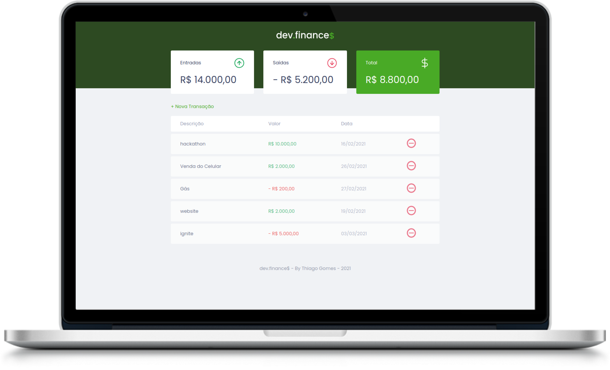

<h1 align="center">
  
</h1>

  
  
  

    

## 💻 Sobre o projeto

O DevFinances é um projeto que ajuda você a controlar seus gastos.

### ❓ Onde eu posso testar ?

Você pode testar [clicando aqui](https://dev-finances.thiagog8.vercel.app).

## 🤔 Como posso contribuir ?

Você pode criar uma issue com uma idea ou relatando um bug.
